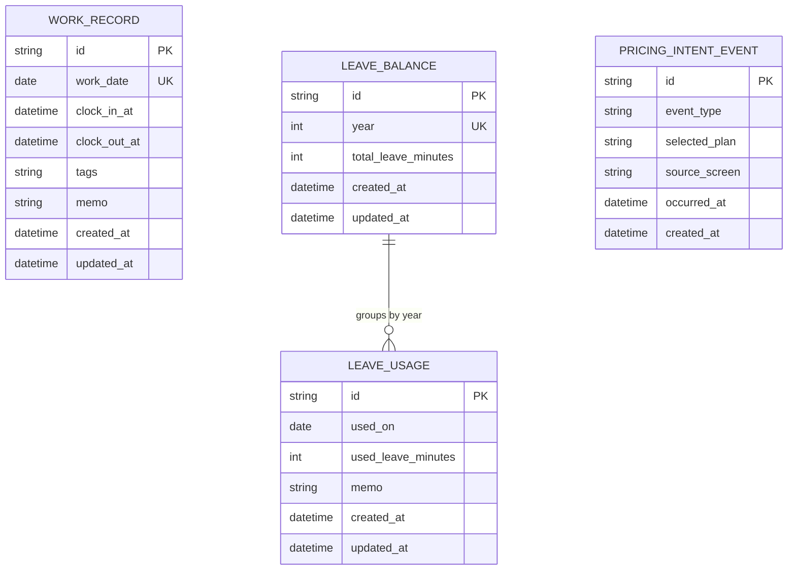
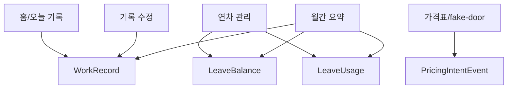

# WorkLedger ERD

## Entity Relationship Diagram

## Relationship Notes

| Relationship | Rule |
|---|---|
| `LeaveBalance` to `LeaveUsage` | `LeaveUsage.usedOn.year`가 `LeaveBalance.year`와 같은 기록을 같은 연차 기준으로 묶는다 |
| `WorkRecord` to `LeaveUsage` | 직접 FK를 두지 않는다. 근무 기록과 연차 사용은 날짜 기준으로 월간 요약에서 함께 조회한다 |
| `PricingIntentEvent` to other entities | 직접 FK를 두지 않는다. 가격 의향은 독립적인 로컬 이벤트 로그다 |

## Cardinality

| Entity | Cardinality Rule |
|---|---|
| `WorkRecord` | `workDate`별 최대 1건 |
| `LeaveBalance` | `year`별 최대 1건 |
| `LeaveUsage` | 같은 날짜에 여러 건 가능 |
| `PricingIntentEvent` | 클릭마다 1건 추가 |

## Data Flow

## MVP Storage Boundary

- 모든 엔티티는 로컬 저장소에만 저장한다.
- 서버 동기화, 로그인 사용자 FK, 회사 FK는 두지 않는다.
- 연차 잔여량과 월간 요약값은 조회 시 계산하며 저장하지 않는다.
- Report Pass/Pro 선택은 실제 결제가 아니라 `PricingIntentEvent`로만 기록한다.
