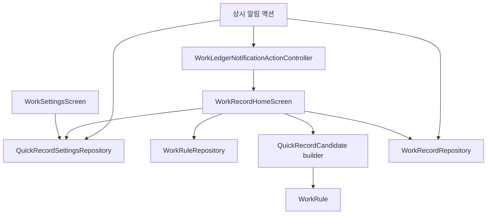
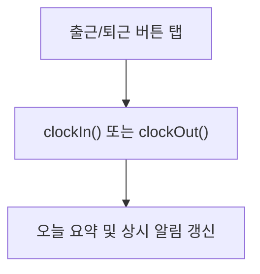
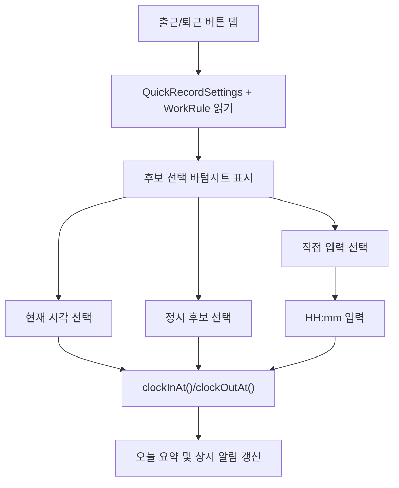

# work-record-quick-record-mode - Design Document

> Version: 1.1.1 | Date: 2026-06-21 | Status: Report Complete
> Level: Starter | Plan: docs/01-plan/features/work-record-quick-record-mode.plan.md

---

## 1. Overview

빠른 기록 방식 설정은 홈 화면의 출근/퇴근 버튼에서 사용자가 기록 시각을 명시적으로 선택할 수 있게 하는 로컬 기능이다.

기본 동작은 기존과 동일하게 현재 시각을 바로 저장한다. 사용자가 설정에서 `QuickRecordMode`를 “저장 전 시각 선택”으로 바꾸면 홈 화면 기록과 상시 알림 출근/퇴근 액션 모두 현재 시각, `WorkRule` 정시 후보, 1분 단위 직접 입력 후보 중 하나를 고른 뒤 저장한다.

이 기능은 자동 보정 기능이 아니다. 앱은 사용자가 선택하지 않은 시각으로 출근/퇴근 기록을 바꾸지 않으며, 자동 반올림, 자동 수당 계산, 법률 판단, 증거 효력 보장을 제공하지 않는다.

## 2. Design Goals

| 목표 | 설계 결정 |
|---|---|
| 10초 이내 출퇴근 기록 유지 | 기본값은 현재 시각 즉시 저장으로 유지한다 |
| 반복 수동 수정 감소 | 사용자가 원할 때 홈 화면과 알림 진입 모두에서 저장 전 후보 시각을 선택하게 한다 |
| 자동 보정 오해 방지 | `QuickRecordMode`를 근로제도나 수당 정책이 아닌 기록 방식 설정으로 정의한다 |
| 유연근무와 1분 단위 기록 고려 | 정시 후보와 별도로 1분 단위 직접 입력 후보를 제공한다 |
| MVP 범위 유지 | 서버, 로그인, 클라우드, GPS, 회사 시스템 연동, 자동 수당 계산은 제외한다 |

## 3. Scope

### 3.1 In Scope

- 설정 화면에 빠른 기록 방식 설정을 추가하는 설계
- `QuickRecordMode` 도메인 모델과 로컬 저장 설계
- 홈 화면 출근/퇴근 버튼의 기록 전 후보 선택 UX
- `WorkRule`의 정시 출근/퇴근 시간을 후보로 읽는 규칙
- 상시 알림 액션의 설정 기반 저장 경로
- 오류 처리, 테스트 계획, 롤백 기준

### 3.2 Out of Scope

- 자동 정시 보정
- 자동 반올림
- 자동 수당 계산
- 기록 시각과 실제 시각의 별도 저장
- 법률 자문, 증거 효력 보장 문구
- 서버, 로그인, 클라우드 동기화
- GPS 자동 기록, 회사 근태 시스템 연동
- Quick Settings Tile, 홈 위젯

## 4. Current Architecture

| 영역 | 현재 책임 |
|---|---|
| `WorkRecordRepository.clockIn()` | repository clock의 현재 시각으로 오늘 출근을 저장한다 |
| `WorkRecordRepository.clockOut()` | repository clock의 현재 시각으로 오늘 퇴근을 저장한다 |
| `LocalStorageWorkRecordRepository` | `work_records` 테이블에 `WorkRecord`를 날짜 키로 저장한다 |
| `WorkRecordHomeScreen` | 오늘 상태를 읽고 primary action에 따라 `clockIn()` 또는 `clockOut()`을 바로 호출한다 |
| `WorkRuleRepository.findActive()` | 현재 근무 기준인 `WorkRule`을 읽는다 |
| `SettingsHomeScreen` / `WorkSettingsScreen` | 근무 기준, 포괄임금 참고 시간 등 근무 설정을 관리한다 |
| `workledger_notification_action.dart` | 상시 알림 액션에서 `clockIn()` 또는 `clockOut()`을 바로 호출한다 |
| `workledger_notification_service.dart` | foreground/background 알림 응답을 처리하고 상시 알림 내용을 갱신한다 |

## 5. Proposed Architecture

### 5.1 Module Boundary

| 파일 또는 영역 | 설계 책임 |
|---|---|
| `lib/features/work_record/domain/quick_record_settings.dart` | `QuickRecordMode`와 빠른 기록 설정 값 정의 |
| `lib/features/work_record/domain/quick_record_settings_repository.dart` | 빠른 기록 설정 저장소 인터페이스 |
| `lib/features/work_record/data/local_storage_quick_record_settings_repository.dart` | 로컬 저장소 구현 |
| `lib/features/work_record/domain/quick_record_candidate.dart` | 홈 화면 후보 시각 계산과 직접 입력 파싱 |
| `lib/features/work_record/domain/work_record_repository.dart` | 선택된 시각으로 저장할 수 있는 clock-in/clock-out 계약 확장 |
| `lib/features/work_record/presentation/work_record_home_screen.dart` | 설정에 따른 후보 선택 UX와 저장 호출 |
| `lib/features/settings/presentation/work_settings_screen.dart` | 빠른 기록 방식 설정 UI |
| `lib/core/notifications/workledger_notification_action.dart` | 알림 액션 파싱, 현재 시각 즉시 저장, 선택 UX 요청 컨트롤러 |
| `lib/core/notifications/workledger_notification_service.dart` | `QuickRecordMode`에 따라 알림 액션을 즉시 저장 또는 앱 선택 UX로 분기 |
| `lib/main.dart` / `lib/app/workledger_app.dart` | 알림에서 들어온 선택 요청을 홈 화면으로 전달 |

### 5.2 Dependency Flow

## 6. Data Model

### 6.1 QuickRecordMode

`QuickRecordMode`는 근로제도나 급여 정책이 아니라 “기록을 저장하기 전 어떤 입력 방식을 사용할지”를 나타낸다.

| 값 | 의미 | 저장 전 UX |
|---|---|---|
| `currentTimeOnly` | 기존처럼 현재 시각을 바로 저장한다 | 없음 |
| `chooseBeforeSave` | 홈 화면과 상시 알림 출근/퇴근 액션에서 저장 전 후보 시각을 선택한다 | 후보 선택 바텀시트 |

기본값은 `currentTimeOnly`이다. 기존 사용자의 10초 기록 흐름을 깨지 않기 위해 새 설정이 없거나 사용자가 바꾸지 않은 경우에는 현재 시각만 저장한다.

### 6.2 QuickRecordSettings

| 필드 | 타입 | 설명 |
|---|---|---|
| `mode` | `QuickRecordMode` | 빠른 기록 방식 |
| `createdAt` | `DateTime` | 설정 최초 저장 시각 |
| `updatedAt` | `DateTime` | 설정 마지막 수정 시각 |

로컬 저장 시 `mode`는 enum name 문자열로 저장한다. 시각 필드는 기존 모델과 동일하게 ISO-8601 문자열을 사용한다.

### 6.3 Storage

| 항목 | 값 |
|---|---|
| table | `quick_record_settings` |
| key | `active` |
| value | `QuickRecordSettings.toMap()` |

설정은 사용자 계정 없이 기기 로컬에만 저장한다. 서버 동기화나 마이그레이션은 이번 범위에 없다.

## 7. Quick Record Candidate Model

### 7.1 Action Type

| 값 | 의미 |
|---|---|
| `clockIn` | 출근 기록 후보를 만든다 |
| `clockOut` | 퇴근 기록 후보를 만든다 |

### 7.2 Candidate Type

| 후보 | 표시 조건 | 저장 시각 |
|---|---|---|
| 현재 시각 | `chooseBeforeSave`에서 항상 표시 | 사용자가 버튼을 누른 현재 시각 |
| 정시 후보 | `WorkRule`이 있을 때 표시 | 출근은 `regularStartTimeMinutes`, 퇴근은 `regularEndTimeMinutes` |
| 직접 입력 | `chooseBeforeSave`에서 항상 표시 | 사용자가 입력한 HH:mm 기준 1분 단위 시각 |

정시 후보는 자동 보정이 아니다. 사용자가 후보를 눌렀을 때만 저장한다.

### 7.3 Candidate Rules

- 후보 시각의 날짜는 홈 화면에서 기록하려는 오늘 날짜를 사용한다.
- 현재 시각 후보는 UI 라벨에서만 초와 밀리초를 숨겨 `HH:mm`으로 표시한다.
- 현재 시각 후보를 선택해 저장할 때는 사용자가 후보를 확정한 실제 `DateTime` 값을 사용하며, 저장 전에 초/밀리초를 자동 절삭하거나 자동 반올림하지 않는다.
- 직접 입력은 `HH:mm` 형식을 기준으로 하며 기존 `ClockTimeInputFormatter` 계열 입력 규칙과 맞춘다.
- `WorkRule`이 없으면 정시 후보를 숨긴다.
- 유연근무 사용자가 정시 후보와 맞지 않을 수 있으므로 현재 시각과 직접 입력 후보는 항상 남긴다.
- 후보 생성은 순수 함수로 설계하고 저장소나 위젯 상태를 직접 바꾸지 않는다.

## 8. WorkRecord Repository Design

현재 `clockIn()`과 `clockOut()`은 repository clock의 현재 시각만 저장한다. 홈 화면에서 선택한 후보 시각을 저장하려면 명시적 시각을 받는 메서드가 필요하다.

| 메서드 | 목적 |
|---|---|
| `clockIn()` | 기존 현재 시각 즉시 저장 |
| `clockOut()` | 기존 현재 시각 즉시 저장 |
| `clockInAt({required DateTime clockInAt})` | 사용자가 선택한 출근 시각 저장 |
| `clockOutAt({required DateTime clockOutAt})` | 사용자가 선택한 퇴근 시각 저장 |

설계 규칙:

- `clockIn()`과 `clockOut()`은 `currentTimeOnly`의 홈 화면 및 알림 즉시 저장 흐름을 위해 유지한다.
- `clockInAt()`과 `clockOutAt()`은 홈 화면과 알림에서 진입한 `chooseBeforeSave` 흐름에서 사용한다.
- `createdAt`과 `updatedAt`은 저장 작업이 일어난 실제 repository clock을 사용한다.
- `clockInAt`과 `clockOutAt`은 사용자가 명시 선택한 기록 시각을 사용한다.
- `clockOutAt`이 `clockInAt`보다 빠르면 `WorkRecordRepositoryException`으로 명확히 실패한다.
- 선택 시각의 날짜가 저장 대상 `workDate`와 다르면 `WorkRecordRepositoryException`으로 명확히 실패한다.

## 9. Home UX Design

### 9.1 Default Flow: currentTimeOnly

사용자가 설정을 바꾸지 않으면 기존 흐름과 동일하다.

### 9.2 Choose Before Save Flow

바텀시트 표시 원칙:

- 제목은 `출근 시각 선택` 또는 `퇴근 시각 선택`으로 표시한다.
- 후보는 “현재 시각”, “정시 출근/퇴근”, “직접 입력” 순서로 둔다.
- 정시 후보에는 `WorkRule`에서 가져온 시간이라는 설명을 붙인다.
- 하단 도움말에 “앱이 시간을 자동 보정하지 않습니다. 선택한 시각만 저장합니다.”를 표시한다.
- 취소하면 아무 기록도 저장하지 않고 홈 상태를 유지한다.

### 9.3 Manual Input

직접 입력은 유연근무와 1분 단위 기록 사용자를 위한 보조 흐름이다.

- 입력 형식은 `HH:mm`이다.
- 저장 대상 날짜는 오늘이다.
- 00:00부터 23:59까지만 허용한다.
- 잘못된 값은 저장하지 않고 구체적인 오류를 보여준다.
- 수당 계산이나 반올림은 수행하지 않는다.

## 10. Persistent Notification UX

상시 알림 출근/퇴근 액션은 `QuickRecordMode`에 따라 분기한다.

| 설정 | 알림 액션 동작 |
|---|---|
| `currentTimeOnly` | 기존처럼 `clockIn()` 또는 `clockOut()`을 호출해 현재 시각으로 즉시 저장한다 |
| `chooseBeforeSave` | 앱을 열고 홈 화면의 `출근 시각 선택` 또는 `퇴근 시각 선택` 바텀시트를 표시한다 |

설계 규칙:

- `chooseBeforeSave`에서 알림 액션을 누르면 선택 완료 전에는 `clockIn()`, `clockOut()`, `clockInAt()`, `clockOutAt()`을 호출하지 않는다.
- 선택 UX는 홈 화면 버튼과 같은 후보 생성 규칙을 사용한다.
- 사용자가 현재 시각, 정시 후보, 직접 입력 중 하나를 확정하면 선택한 시각으로 `clockInAt()` 또는 `clockOutAt()`을 1회 호출한다.
- 저장 완료 후 오늘 요약과 상시 알림 본문을 갱신한다.
- `currentTimeOnly`에서는 Android 알림의 빠른 저장 가치를 유지하기 위해 앱 선택 UX를 열지 않는다.
- `chooseBeforeSave`에서는 Android 알림 액션에 `showsUserInterface: true`를 적용해 앱 전환 의도를 명시한다.

알림 설정 화면에는 다음 의미가 드러나야 한다.

- 현재 시각만 저장 방식에서는 상시 알림의 `출근하기`와 `퇴근하기`가 현재 시각으로 바로 저장된다.
- 저장 전 시각 선택 방식에서는 상시 알림의 `출근하기`와 `퇴근하기`도 앱을 열어 시각을 고른 뒤 저장한다.
- 알림 권한이 없어도 앱 내부 홈 화면 기록은 계속 가능하다.

## 11. Settings UX Design

빠른 기록 방식 설정은 “근무 설정” 안에 둔다.

이유:

- `WorkRule`의 정시 출근/퇴근 후보와 연결된다.
- 알림 권한 설정이 아니라 기록 입력 방식 설정이다.
- 근무 기준을 설정하는 사용자가 자연스럽게 발견할 수 있다.

옵션 문구:

| 옵션 | 설명 |
|---|---|
| 현재 시각만 저장 | 출근/퇴근 버튼을 누른 현재 시각을 바로 저장 |
| 저장 전 시각 선택 | 홈 화면과 상시 알림 기록 전에 현재 시각, 정시 후보, 직접 입력 중 선택 |

주의 문구:

> 앱이 시간을 자동 보정하지 않습니다. 선택한 시각만 저장합니다.

## 12. Error Handling

| 상황 | 처리 |
|---|---|
| 빠른 기록 설정 파싱 실패 | `QuickRecordSettingsRepositoryException`에 table/key/cause 포함 |
| 알 수 없는 `QuickRecordMode` 저장값 | 명시적 parse exception 발생 |
| `WorkRule` 읽기 실패 | 홈 화면 오류 메시지 표시, 저장 중단 |
| 직접 입력 형식 오류 | 저장하지 않고 입력 오류 표시 |
| 퇴근 시각이 출근보다 빠름 | `WorkRecordRepositoryException`으로 저장 실패 |
| 이미 출근 또는 이미 퇴근 | 기존 repository 오류 정책 유지 |
| 알림 갱신 실패 | `WorkLedgerNotificationException`으로 표시하고 저장 성공처럼 숨기지 않음 |

오류는 조용히 무시하지 않는다. 저장 실패 시 사용자가 어떤 입력을 고쳐야 하는지 알 수 있는 메시지를 제공한다.

## 13. State Transition

| 현재 상태 | 사용자 행동 | 다음 상태 |
|---|---|---|
| 기록 없음 | 현재 시각 출근 저장 | 출근 완료 |
| 기록 없음 | 정시 또는 직접 입력 출근 저장 | 출근 완료 |
| 출근 완료 | 현재 시각 퇴근 저장 | 퇴근 완료 |
| 출근 완료 | 정시 또는 직접 입력 퇴근 저장 | 퇴근 완료 |
| 퇴근 완료 | 홈 primary action | 기존 오늘 기록 수정 화면 |

상태 판단은 기존 `TodayWorkSummary`와 `TodayWorkPrimaryAction` 흐름을 유지한다.

## 14. Test Plan

### 14.1 Domain Tests

| 테스트 | 검증 내용 |
|---|---|
| `QuickRecordMode.fromStorageValue` | 알려진 값은 파싱하고 알 수 없는 값은 명시 오류 |
| `QuickRecordSettings.fromMap` | 필수 필드, enum 값, ISO-8601 시각 검증 |
| candidate builder | `currentTimeOnly`에서는 후보 선택 없이 기존 흐름 유지 |
| candidate builder | `chooseBeforeSave`에서 현재 시각, `WorkRule` 정시 후보, 직접 입력 후보 생성 |
| manual input parser | `HH:mm`, 00:00, 23:59, 잘못된 hour/minute 검증 |

### 14.2 Repository Tests

| 테스트 | 검증 내용 |
|---|---|
| quick settings save/find | `quick_record_settings` active key 저장/조회 |
| quick settings parse error | table/key/cause 포함 오류 |
| `clockInAt` | 선택한 출근 기록 시각은 `clockInAt`에 저장하고, `createdAt`/`updatedAt`은 fake repository clock의 실제 저장 시각으로 저장 |
| `clockOutAt` | 선택한 퇴근 기록 시각은 `clockOutAt`에 저장하고, `createdAt`/`updatedAt`은 fake repository clock의 실제 저장 시각으로 저장 |
| invalid selected time | 날짜 불일치 또는 퇴근<출근 오류 |

### 14.3 Widget Tests

| 화면 | 검증 내용 |
|---|---|
| `WorkSettingsScreen` | 빠른 기록 방식 옵션 표시, 저장 호출 |
| `WorkRecordHomeScreen` | `currentTimeOnly`에서 홈 버튼 1회 탭만으로 `clockIn()` 또는 `clockOut()`을 호출해 10초 이내 기록 목표를 유지 |
| `WorkRecordHomeScreen` | `chooseBeforeSave`에서 후보 바텀시트 표시 |
| `WorkRecordHomeScreen` | `chooseBeforeSave`에서 현재 시각 후보 선택 시 바텀시트 표시 후 현재 시각 후보 1회 선택으로 저장 완료 |
| `WorkRecordHomeScreen` | 정시 후보 선택 시 `clockInAt` 또는 `clockOutAt` 호출 |
| `WorkRecordHomeScreen` | 직접 입력 1분 단위 저장 |
| `WorkRecordHomeScreen` | 알림에서 진입한 `chooseBeforeSave` 요청이 저장 전 같은 후보 바텀시트를 표시 |
| `NotificationSettingsScreen` | 알림 액션이 설정에 따라 즉시 저장 또는 선택 UX로 동작함을 설명 |

### 14.4 Regression Tests

- `flutter analyze`
- `flutter test`
- 기존 상시 알림 액션 테스트
- `currentTimeOnly` 설정 상태에서 상시 알림 `출근하기`/`퇴근하기`가 `clockIn()`/`clockOut()`을 호출하는지 검증
- `chooseBeforeSave` 설정 상태에서 상시 알림 `출근하기`/`퇴근하기`가 선택 UX를 열고 선택 전 저장하지 않는지 검증
- 알림 선택 UX에서 현재 시각, `WorkRule` 정시 후보, 직접 입력값이 홈 화면과 같은 저장 계약을 사용하는지 검증
- Android 실기기에서 notification shade 액션 탭 후 앱 자동 오픈, 선택 UX 표시, 선택 전 미저장, 선택 후 저장, 알림 본문 갱신을 검증
- 기존 work record repository 테스트
- 기존 settings screen 테스트

## 15. Implementation Order

1. `QuickRecordMode`와 `QuickRecordSettings` 도메인 모델 추가
2. 로컬 설정 repository 추가
3. 후보 생성 및 직접 입력 파서 추가
4. `WorkRecordRepository`에 선택 시각 저장 메서드 추가
5. 홈 화면 후보 선택 UX 연결
6. 근무 설정 화면에 빠른 기록 방식 설정 추가
7. 알림 액션을 `QuickRecordMode` 기준으로 즉시 저장 또는 앱 선택 UX로 분기
8. 상시 알림 설명 문구 보강
9. domain/repository/widget/notification 회귀 테스트 추가
10. `flutter analyze`, `flutter test`, release build, Android 실기기 검증 실행

## 16. Design Decisions

| 결정 | 이유 |
|---|---|
| `QuickRecordMode`는 work_record feature 안에 둔다 | 설정이 출퇴근 기록 입력 방식에 직접 연결된다 |
| 기본값은 `currentTimeOnly` | 기존 사용자의 10초 기록 흐름을 유지한다 |
| 정시 후보는 `WorkRule`을 읽어 만든다 | 새 근무 기준 모델을 만들지 않고 기존 정시 설정을 재사용한다 |
| 알림 액션은 `QuickRecordMode`에 맞춰 분기 | 사용자가 저장 전 선택 방식을 고른 경우 모든 주요 기록 진입점에서 같은 의도를 보장한다 |
| 직접 입력은 1분 단위로만 제공 | 유연근무와 1분 단위 기록 수요를 지원하되 수당 계산으로 확장하지 않는다 |
| 기록 시각/실제 시각 분리 저장은 제외 | 데이터 모델 복잡도가 커 MVP 범위를 넘는다 |

## 17. Acceptance Mapping

| Plan Requirement | Design Coverage |
|---|---|
| FR-01 빠른 기록 방식 설정 | Sections 6, 11 |
| FR-02 현재 시각 저장 유지 | Sections 6, 9 |
| FR-03 정시 후보 명시 선택 | Sections 7, 9 |
| FR-04 자동 변경 금지 | Sections 1, 7, 10, 16 |
| FR-05 10초 이내 흐름 | Sections 2, 9, 10 |
| FR-06 상시 알림 액션 | Section 10 |
| FR-07 기존 수동 수정 흐름 | Section 13 |
| FR-08 기록 방식 표현 | Sections 6, 11 |
| FR-09 유연근무/1분 단위 고려 | Sections 7, 9, 14 |

## 18. Rollback Plan

이 기능 구현 중 문제가 생기면 다음 순서로 되돌린다.

1. 설정 UI 노출을 제거한다.
2. 홈 화면에서 `chooseBeforeSave` 분기를 제거하고 `clockIn()`/`clockOut()` 즉시 저장으로 되돌린다.
3. `quick_record_settings` 로컬 값은 읽지 않는다.
4. 기존 `WorkRecord` 데이터는 변경하지 않았으므로 데이터 삭제가 필요하지 않다.

## 19. Implementation Follow-up Decisions

1. 직접 입력 후보는 별도 dialog로 받는다. 바텀시트는 후보 선택에 집중하고, `HH:mm` 입력 오류는 dialog 안에서 표시한다.
2. `clockOutAt`이 출근보다 빠르면 기존 repository 오류 정책을 유지하고 홈 화면 오류 메시지로 저장 실패를 안내한다.
3. 빠른 기록 방식 저장 실패는 근무 기준 저장 성공처럼 숨기지 않는다. 설정 저장 실패 메시지를 표시하고 사용자가 다시 시도하게 한다.
4. 알림에서 앱을 연 직후 선택 UX가 표시되는지 Android 실기기에서 확인했다. 실행 중 및 앱 kill 이후 notification action 모두 홈 화면 선택 UX를 표시했다.
